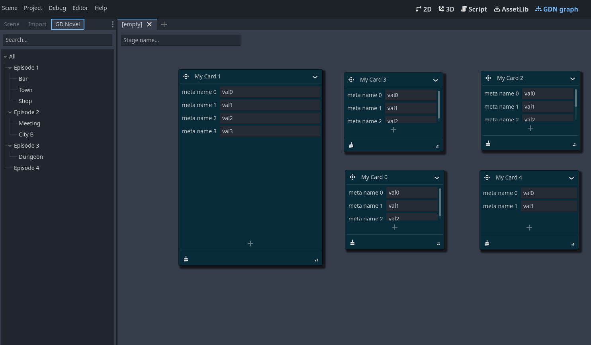

## Godot Novel Plugin

**This project is not related or made by official godot devs.**

The goal of this project to allow easy editing or(and) planning game scenario and dialogues in a way of cards wall.

All the data is saved in a json file. Plugin is not needed for an end game to work.  
Each leaf of the tree on the left is supposed to open new card wall. The tree and the cards are save in JSON format.

Icons provided by [bootstrap project](https://github.com/twbs/icons) and [godot](https://github.com/godotengine/godot/blob/master/editor/icons).